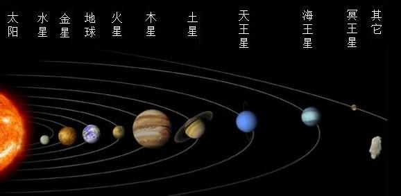

# 图片元素

## img元素

- image缩写，空元素

- src属性: source(源)

- usemap属性：地图锚点


alt属性: 当图片资源失效时，将使用该属性的文字替代图片。

```

    
    

```

## 和a元素联用


```

    <a href="https://www.baidu.com" target="_blank">
        
    </a>
```

## 和map元素联用

map:地图


## 和map元素、area元素联用

img的锚点要和map中的name一致

- shape属性: circle(圆形) rect (矩形) poly(多边形)

- coords属性：坐标

衡量坐标时，为了避免误差，需要使用专业的衡量工具（Photoshop，pxcook）


```
    <a href="https://www.sina.com.cn" target="_blank" > 
        
    </a>

    <map name="solarMap">
        <area shape="circle" coords="280,245,33" href="https://www.baidu.com" target="_blank" >
        <area shape="rect" coords="244,114,370,200" href="https://www.baidu.com" target="_blank" >
        <area shape="poly" coords="234,433,454,676,343,453" href="https://www.baidu.com" target="_blank"  >
    </map>
```

## 和figure元素联用

figure:指代、定义的意思，通常用于把图片、图片标题、描述包裹起来。

子元素：figcaption

```
    <figure>
        <figcaption>
            <a href="https://www.sina.com.cn" target="_blank" style="border:5px solid;"> 
                
            </a>
            
            <h2>
                太阳系
            </h2>
            <p>太阳系太阳系太阳系太阳系太阳系太阳系太阳系</p>
        </figcaption>
    </figure>
```